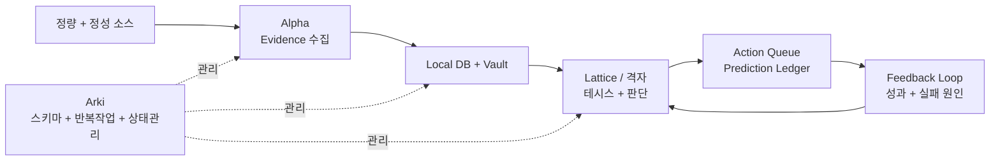

# Thesis OS

[English README](README.md)

Thesis OS는 **테시스 기반 투자 리서치 OS**입니다.

정량 데이터와 정성 인텔리전스를 수집하고, 로컬 데이터베이스와 마크다운 vault에 축적한 뒤, 이를 투자 테시스, 행동 판단, 예측 원장, 사후 피드백 루프로 변환합니다.

목표는 자동매매 봇을 만드는 것이 아닙니다. 목표는 투자 판단을 더 명시적이고, 근거 기반이며, 감사 가능하고, 시간이 지날수록 개선 가능한 형태로 만드는 것입니다.

## 핵심 루프



핵심은 명시성입니다. evidence를 모으고, 기억에 쓰고, 테시스를 만들고, 예측을 사전에 기록하고, 결과를 평가한 뒤, 다음 판단을 개선합니다.

## 세 에이전트

### Alpha: Evidence

Alpha는 데이터를 수집하고 검증합니다.

- 정량 데이터: 가격, 거래량, 수급, 실적, 공시, 컨센서스, 공매도, 수출입 데이터
- 정성 데이터: 뉴스, 공시, 유튜브, 텔레그램, 페이스북, 뉴스레터, 커뮤니티 신호
- 출력: evidence record, local DB snapshot, screener candidate, research packet

### Lattice / 격자: Judgment

Lattice는 evidence를 투자 판단으로 바꿉니다.

이 이름은 찰리 멍거의 **격자적 사고**, 즉 *latticework of mental models*에서 따왔습니다. 좋은 투자 판단은 하나의 렌즈만으로 만들어지지 않습니다. evidence, 인센티브, 베이스레이트, 시장 구조, 밸류에이션, 리스크, 반대 논리를 함께 엮어야 합니다. 한국어 버전에서는 이 역할을 **격자**라고 부릅니다.

담당 범위:

- Thesis Registry
- Decision Card
- Devil's Advocate Gate
- Action Queue
- Prediction Ledger
- Feedback Interpretation

### Arki: System

Arki는 Research OS의 구조와 운영을 관리합니다.

- 스키마
- vault layout
- 반복작업
- health check
- migration log
- agent skill governance

## 빠른 시작

Python 3.10+이 필요합니다.

```bash
git clone https://github.com/youngseongshin/thesis-os.git
cd thesis-os
python3 -m venv .venv
. .venv/bin/activate
python -m pip install -e .
python -m thesis_os demo --out ./demo_run
```

에이전트별 명령:

```bash
python -m thesis_os arki init --workspace ./workspace
python -m thesis_os alpha sample-collect --workspace ./workspace
python -m thesis_os alpha list-evidence --workspace ./workspace
python -m thesis_os lattice build-thesis --workspace ./workspace
python -m thesis_os lattice decision-card --workspace ./workspace
python -m thesis_os lattice predict --workspace ./workspace \
  --prediction "Evidence가 유지되면 이 basket은 benchmark를 outperform해야 한다." \
  --direction relative_outperform \
  --horizon 1m
```

## 공개 / 비공개 경계

공개 repo에 포함되는 것:

- 철학과 아키텍처 문서
- JSON schema
- 샘플 adapter contract
- 샘플 local DB / vault 생성
- prediction ledger와 feedback evaluator

공개 repo에 포함하지 않는 것:

- 실제 계좌/포트폴리오 데이터
- API key
- OAuth token
- 쿠키
- 텔레그램 세션
- Gmail 원문
- 유료 데이터 raw
- 사적 vault

## 프로젝트 상태

현재는 public core scaffold 단계입니다. 하지만 최소 루프는 실제로 동작합니다.

1. Evidence 생성
2. Local DB와 vault 저장
3. Thesis 생성
4. Decision Card 생성
5. Prediction Ledger 기록
6. Feedback Report 생성

유용하다면 star를 눌러주세요. 이 프로젝트는 투자 판단을 “그럴듯한 설명”에서 “검증 가능한 판단 시스템”으로 바꾸는 것을 목표로 합니다.
