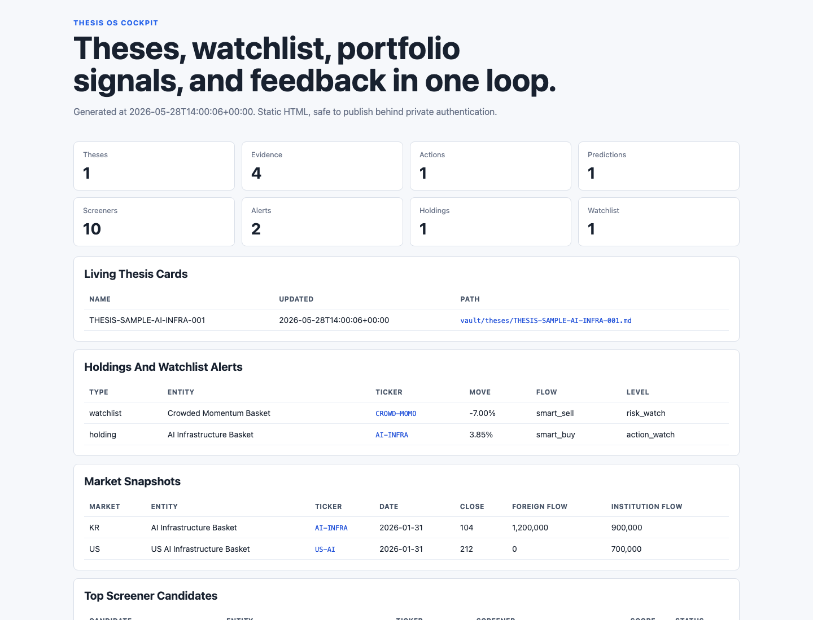
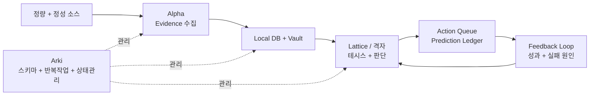
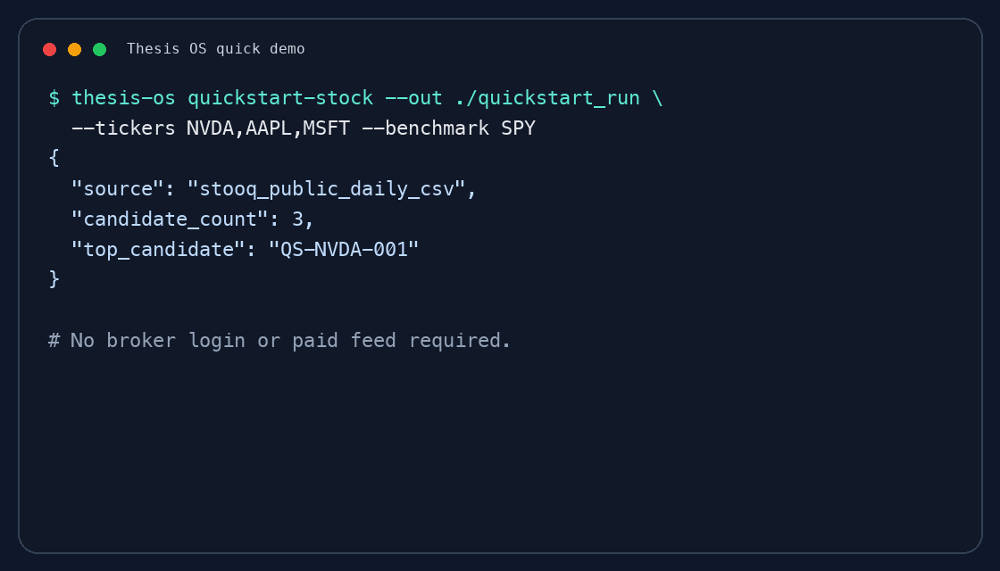
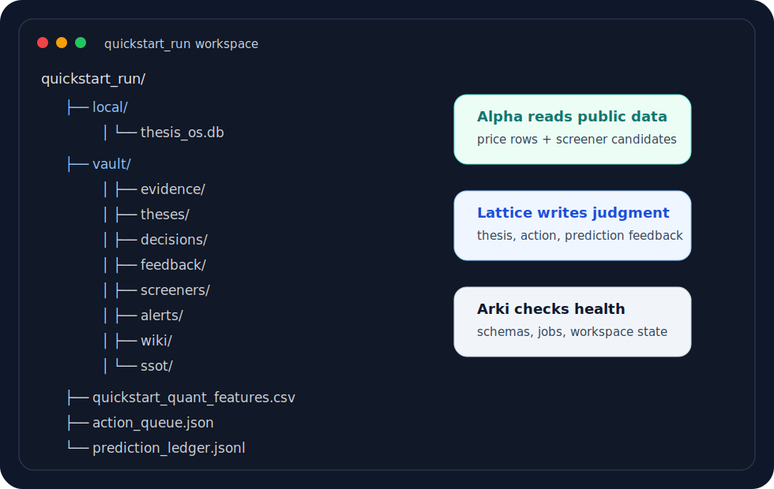

# Thesis OS

[English README](README.md)

> 시장을 요약하는 에이전트가 아니라, 테시스를 유지하고, 판단을 기록하고, 예측을 사전에 남기고, 나중에 스스로 채점하는 투자 리서치 에이전트 시스템.

Thesis OS는 **근거 우선, 테시스 기반 투자 리서치 OS**입니다.

정량 데이터, 정성 인텔리전스, 로컬 데이터베이스, 마크다운 vault, 에이전트 워크플로우, 예측 원장, 피드백 루프를 하나의 감사 가능한 판단 기계로 묶습니다.

목표는 자동매매 봇이나 AI 종목 추천기를 만드는 것이 아닙니다. 목표는 투자 판단을 더 명시적이고, 검증 가능하며, 시간이 지날수록 개선 가능한 형태로 만드는 것입니다.

## 지금 바로 확인할 수 있는 것

공개 데모는 증권사 계정, 사적 텔레그램, 유료 피드 없이 실행됩니다.

| 목표 | 시작 지점 | 결과 |
|---|---|---|
| 전체 테시스 루프 실행 | `thesis-os demo --out ./demo_run` | local DB, vault note, thesis card, decision card, prediction ledger, feedback note, dashboard 생성 |
| 콕핏 확인 | `open ./demo_run/vault/dashboard/index.html` | thesis, watchlist, action, prediction, feedback을 한 화면에서 확인 |
| 실제 산출물 구조 보기 | [`examples/sample_outputs/`](examples/sample_outputs/) | 공개 안전 테시스 카드, Top 5 딥다이브, 집중전략, 스크리너 결과, 스크리너 피드백, 소셜 수집 예시 |
| 시스템 확장 | [`examples/sample_jobs.yaml`](examples/sample_jobs.yaml), [`examples/sample_agent_skills.yaml`](examples/sample_agent_skills.yaml) | 반복작업과 스킬을 감사 가능한 contract로 정의 |

## 무엇이 다른가?

| 일반적인 투자 리서치 흐름 | Thesis OS |
|---|---|
| 리서치 노트가 쌓이고 금방 낡음 | 테시스 카드가 최신 evidence와 계속 연결됨 |
| 스크리너가 리스트만 만들고 책임지지 않음 | 후보 종목을 기간별 forward 성과로 평가 |
| LLM이 그럴듯한 내러티브를 작성 | Lattice/격자가 action, prediction, 무효화 조건, feedback을 기록 |
| 데이터가 여러 도구에 흩어짐 | Local DB + markdown vault + wiki/SSOT로 검색과 참조를 정리 |
| 자동화가 여러 스크립트 묶음으로 흩어짐 | harness contract가 owner, trigger, input, output, delivery, failure policy를 명시 |
| 포트폴리오 리뷰가 사후 감사하기 어려움 | dashboard cockpit이 thesis, watchlist alert, action, prediction, performance feedback을 한 화면에 표시 |

## 60초 실행

```bash
git clone https://github.com/youngseongshin/thesis-os.git
cd thesis-os
python3 -m venv .venv
. .venv/bin/activate
python -m pip install -e .
thesis-os demo --out ./demo_run
```

데모는 local SQLite DB, markdown vault, thesis card, decision card, prediction ledger, screener output, feedback note, 자동화 검증 결과, 샘플 adapter evidence, static dashboard를 생성합니다. 대시보드는 `demo_run/vault/dashboard/index.html`에서 확인할 수 있습니다.

<p align="center">
  
</p>

<p align="center">
  
</p>

## 핵심 루프



핵심은 명시성입니다. evidence를 모으고, 기억에 쓰고, 테시스를 만들고, 예측을 사전에 기록하고, 결과를 평가한 뒤, 다음 판단을 개선합니다.

## 왜 Thesis OS인가?

핵심 가치는 단순히 데이터를 모으거나 노트를 저장하는 데 있지 않습니다.

중요한 것은 **테시스 카드가 계속 살아 있어야 한다는 점**입니다.

- Alpha는 정량/정성 evidence를 계속 수집합니다.
- 한국과 미국 장 마감 이후 Alpha는 상장주식 local DB를 최신화합니다.
- 종목 발굴은 정량 스크리너, 소셜/커뮤니티 수집, 애널리스트 리포트 수집 세 채널로 매일 수행합니다.
- 종합 스크리닝은 종목별 신호를 Top 5 편입심사 큐로 압축합니다.
- 장중에는 보유종목과 관찰종목의 가격/수급 변화를 모니터링해 알람 후보를 만듭니다.
- Lattice/격자는 Alpha, 스크리너, 알람, local DB 데이터를 읽고 테시스 카드를 갱신합니다.
- 격자는 포트폴리오 편입, 증액, 홀드, 감액, 청산, 관찰 판단을 내립니다.
- 이후 3일, 1주, 1개월 같은 기간 단위로 판단 성과를 평가합니다.
- 그 결과가 다시 테시스, 스크리너 룰, 격자의 판단 프로세스에 환류됩니다.
- Arki는 vault, SSOT, wiki index, schema, 반복작업을 정리해 에이전트 참조가 최신 상태로 유지되게 합니다.

즉 Thesis OS의 본질은 **상장주식 DB 최신화 -> evidence 갱신 -> 3채널 종목 발굴 -> Top 5 압축 -> 격자 편입심사 -> 예측/행동 기록 -> 기간별 성과평가 -> 테시스와 판단 프로세스 업데이트**로 이어지는 완결적인 피드백 루프입니다.

## 운영 워크플로우

기본 워크플로우는 보유 종목과 워치리스트를 전제로 합니다.

1. 한국과 미국 장 마감 이후 Alpha가 상장주식 local DB를 최신화합니다.
2. Alpha가 티어1 정보, 뉴스, 공시, 시장 데이터, 정량 스크리너, 소셜/커뮤니티, 애널리스트 리포트 신호를 갱신합니다.
3. Alpha가 evidence record, market snapshot, intraday alert, screener candidate를 local DB와 vault에 저장합니다.
4. Alpha가 종합 스크리닝으로 매일 Top 5 편입심사 큐를 만듭니다.
5. 장중에는 보유종목과 관찰종목에 대해 가격/수급 알람을 생성합니다.
6. Lattice/격자가 최신 evidence로 thesis card를 검토하고, 포트폴리오 편입 여부를 심사합니다.
7. 격자가 매일 roundtable을 열어 증액, 홀드, 감액, 청산, 관찰 판단을 내립니다.
8. 판단이 시장 결과로 검증 가능하면 Prediction Ledger 또는 Action Queue에 사전 기록합니다.
9. 이후 기간별 성과평가가 테시스, 스크리너 룰, 격자의 판단 프로세스에 다시 환류됩니다.

기본 투자철학은 명확합니다. **멍거의 격자적 사고로 발굴하고, 윌리엄 오닐과 마크 미네르비니로 투자 타이밍을 선별하고, 드라켄밀러처럼 비대칭 기회에 집중적으로 베팅한다**는 구조입니다.

## 기본 투자철학

실제 Thesis OS 배포 환경에서는 vault에 **투자철학 원장**을 둘 수 있습니다. 공개 버전에서는 같은 원칙을 [Investment Philosophy](docs/investment-philosophy.md)에 문서화합니다. 철학은 감각으로 남겨두는 것이 아니라, 판단과 연결되고, 사후 피드백으로 검증되어야 합니다.

기본 철학은 세 층입니다.

| 층 | 투자자 렌즈 | Thesis OS에서의 의미 |
|---|---|---|
| 발굴 | 찰리 멍거 | evidence, 인센티브, 베이스레이트, 시장 구조, 밸류에이션, 리스크, 반대 논리를 격자처럼 엮어 기회를 찾음 |
| 타이밍 | 윌리엄 오닐 + 마크 미네르비니 | 상대강도, 주도주, 가격/거래량 구조, 과열 여부, 손절/무효화 조건으로 진입 타이밍을 선별 |
| 베팅 | 스탠리 드라켄밀러 | 근거, 타이밍, 손익비, 유연성이 맞을 때만 집중하고, 사실이 바뀌면 빠르게 바꿈 |

실제 운영에서는 이렇게 번역됩니다.

- Alpha는 정량 스크리너, 소셜 수집, 애널리스트 리포트 수집으로 후보를 발굴합니다.
- Lattice/격자는 멍거식 격자 사고로 후보를 하나의 스토리가 아니라 여러 렌즈로 해석합니다.
- 격자는 오닐/미네르비니식 타이밍 규율로 약한 셋업, 과열된 셋업, 무효화된 셋업을 걸러냅니다.
- 격자는 드라켄밀러식 관점으로 소수의 비대칭 기회에 집중하되, 증거가 바뀌면 판단을 바꿉니다.
- 피드백 루프는 이 철학이 실제로 판단 품질을 높였는지 기간별 성과로 검증합니다.

## 세 에이전트

### Alpha: Evidence

Alpha는 데이터를 수집하고 검증합니다.

- 정량 데이터: 가격, 거래량, 수급, 실적, 공시, 컨센서스, 공매도, 수출입 데이터
- 정성 데이터: 뉴스, 공시, 유튜브, 텔레그램, 페이스북, 뉴스레터, 커뮤니티 신호
- 발굴 채널: 정량 스크리너, 소셜/커뮤니티 수집, 애널리스트 리포트 수집
- 출력: evidence record, local DB snapshot, market refresh note, intraday alert, screener candidate, Top 5 discovery queue, research packet

### Lattice / 격자: Judgment

Lattice는 evidence를 투자 판단으로 바꿉니다.

이 이름은 찰리 멍거의 **격자적 사고**, 즉 *latticework of mental models*에서 따왔습니다. 좋은 투자 판단은 하나의 렌즈만으로 만들어지지 않습니다. evidence, 인센티브, 베이스레이트, 시장 구조, 밸류에이션, 리스크, 반대 논리를 함께 엮어야 합니다. 한국어 버전에서는 이 역할을 **격자**라고 부릅니다.

담당 범위:

- Thesis Registry
- Decision Card
- Devil's Advocate Gate
- Action Queue
- Prediction Ledger
- Feedback Interpretation
- Screener Forward-Performance Review
- Judgment Feedback Review

### Arki: System

Arki는 Thesis OS의 구조와 운영을 관리합니다.

- 스키마
- vault layout
- 반복작업
- health check
- migration log
- agent skill governance

## 명령어 레퍼런스

Python 3.10+이 필요합니다.

<p align="center">
  
</p>

```bash
git clone https://github.com/youngseongshin/thesis-os.git
cd thesis-os
python3 -m venv .venv
. .venv/bin/activate
python -m pip install -e .
python -m thesis_os demo --out ./demo_run
```

생성되는 workspace 구조:

<p align="center">
  
</p>

에이전트별 명령:

```bash
python -m thesis_os arki init --workspace ./workspace
python -m thesis_os alpha sample-collect --workspace ./workspace
python -m thesis_os alpha run-screener --workspace ./workspace
python -m thesis_os alpha run-quant-screener --workspace ./workspace \
  --input-csv ./demo_run/sample_quant_features.csv \
  --top-n 5
python -m thesis_os alpha discover --workspace ./workspace --top-n 5
python -m thesis_os alpha refresh-market-db --workspace ./workspace \
  --input-csv ./demo_run/sample_market_snapshots.csv
python -m thesis_os alpha intraday-monitor --workspace ./workspace \
  --input-csv ./demo_run/sample_intraday_events.csv
python -m thesis_os alpha trade-proxy --workspace ./workspace \
  --input-csv ./demo_run/sample_trade_proxy.csv \
  --proxy-name semiconductor-memory
python -m thesis_os alpha list-screeners --workspace ./workspace
python -m thesis_os alpha list-evidence --workspace ./workspace
python -m thesis_os lattice build-thesis --workspace ./workspace
python -m thesis_os lattice decision-card --workspace ./workspace
python -m thesis_os lattice predict --workspace ./workspace \
  --prediction "Evidence가 유지되면 이 basket은 benchmark를 outperform해야 한다." \
  --direction relative_outperform \
  --horizon 1m
python -m thesis_os lattice evaluate-screener --workspace ./workspace \
  --candidate-id SCR-AI-INFRA-001 \
  --horizon 1m \
  --absolute-return 0.04 \
  --benchmark-return 0.015
python -m thesis_os lattice evaluate-judgment --workspace ./workspace \
  --action-id ACTION-SAMPLE-001 \
  --horizon 1m \
  --absolute-return 0.04 \
  --benchmark-return 0.015
python -m thesis_os lattice roundtable --workspace ./workspace
python -m thesis_os arki build-wiki-index --workspace ./workspace
python -m thesis_os arki validate-harness --workspace ./workspace \
  --input-json ./demo_run/sample_harness_contracts.json
python -m thesis_os arki build-dashboard --workspace ./workspace
```

## 공개 / 비공개 경계

공개 repo에 포함되는 것:

- 철학과 아키텍처 문서
- 에이전트 페르소나 계약과 프롬프트 경계 가이드
- vault, local DB, LLM wiki, prediction, feedback을 위한 메모리 관리 프로세스
- document policy, codeowners, canonical path, validator, cleanup을 위한 vault governance 패턴
- 텔레그램/페이스북/유튜브 수집, 실시간 데이터, 딥다이브, 반도체 전문분석, 딥알파, 악마의 변호인, 피드백을 위한 skill catalog
- JSON schema
- 샘플 adapter contract
- 샘플 local DB / vault 생성
- prediction ledger와 feedback evaluator
- thesis card, nightly screening, concentrated strategy, screener feedback, social collection 샘플 산출물
- 반도체/공급망 테시스를 위한 CSV 기반 통관/수출입 proxy evidence adapter
- 반복작업의 owner, trigger, input, output, delivery, failure policy를 검증하는 harness contract schema와 validator
- 테시스, 워치리스트, 보유종목 알람, action queue, prediction ledger, 성과 피드백을 한 화면에 보여주는 static HTML dashboard cockpit
- Thesis OS의 구현/부분구현/제외 항목을 정리한 coverage matrix
- 시장 DB 갱신, 소스 수집, 스크리너, 라운드테이블, 피드백, wiki, health check를 위한 공개 안전 반복작업 manifest

공개 repo에 포함하지 않는 것:

- 실제 계좌/포트폴리오 데이터
- API key
- OAuth token
- 쿠키
- 텔레그램 세션
- Gmail 원문
- 유료 데이터 raw
- 사적 vault

## 샘플 산출물 팩

공개 repo에는 Thesis OS의 구조를 이해할 수 있는 공개 안전 샘플 산출물이 포함되어 있습니다.

| 산출물 | 보여주는 것 |
|---|---|
| [테시스 카드](examples/sample_outputs/thesis-card-ai-infrastructure-basket.md) | evidence, assumption, invalidation, action hook이 한 카드에 연결되는 방식 |
| [나이트 Top 5 딥다이브](examples/sample_outputs/nightly-top5-deep-dive.md) | 매일 발굴된 후보가 포트폴리오 심사 전 Top 5로 압축되는 방식 |
| [나이트 집중전략 리뷰](examples/sample_outputs/nightly-concentration-strategy.md) | 격자가 후보를 집중, 유지, 감액, 관찰 판단으로 바꾸는 방식 |
| [스크리너 종목 발굴 결과](examples/sample_outputs/screener-discovery-results.md) | 정량 스크리너가 설명 가능한 후보 큐를 만드는 방식 |
| [스크리너 성과 피드백](examples/sample_outputs/screener-performance-feedback.md) | forward return으로 스크리너 신호가 실제로 유효했는지 평가하는 방식 |
| [소셜 수집 요약](examples/sample_outputs/social-collection-summary.md) | 사적 raw feed를 공개하지 않고 정성 채널을 요약하는 방식 |

이 샘플들은 모두 합성 예시입니다. 실제 포트폴리오, 실제 보유 비중, 사적 채널 원문, 계좌 정보, 유료 데이터 raw를 포함하지 않습니다. 자세한 공개 경계는 [Sample Output Pack](docs/sample-output-pack.md)을 참고하세요.

## 에이전트 페르소나와 프롬프트

에이전트 설계도 시스템 설계의 일부입니다. Thesis OS는 Alpha, Lattice/격자, Arki를 서로 다른 역할과 성격을 가진 운영 주체로 봅니다.

- [Three-Agent Model](docs/three-agent-model.md)
- [Agent Persona Contracts](docs/agent-persona-contracts.md)

공개 프로젝트에는 재사용 가능한 역할 계약과 출력 경계를 문서화합니다. 실제 개인 배포 환경에서는 이를 전체 시스템 프롬프트로 확장할 수 있지만, 사용자 취향, 사적 메모리, 계정/채널 정보, 운영 세부사항은 공개 repo 밖에 둬야 합니다.

## 반복 실행작업

Thesis OS는 반복 실행작업을 통해 살아 움직입니다. 공개 core에는 다음 문서와 샘플 manifest가 포함됩니다.

- [Recurring Jobs](docs/recurring-jobs.md)
- [sample_jobs.yaml](examples/sample_jobs.yaml)

manifest에는 장 마감 후 market DB 갱신, 티어1 evidence 갱신, 정성 채널 수집, 스크리너, Top 5 발굴, 장중 모니터링, 라운드테이블, 집중전략 리뷰, 예측 평가, 스크리너 피드백, vault/wiki 컴파일, health check가 포함됩니다.

## 메모리 관리

Thesis OS에서 메모리는 단순 저장소가 아니라 관리되는 프로세스입니다.

- [Memory Management](docs/memory-management.md)
- [Vault Governance](docs/vault-governance.md)
- [Vault, SSOT, And LLM Wiki](docs/vault-ssot-wiki.md)
- [sample_memory_policy.yaml](examples/sample_memory_policy.yaml)
- [sample_vault_policy.yaml](examples/sample_vault_policy.yaml)

메모리 루프는 다음과 같습니다.

```text
capture -> normalize -> classify -> promote/discard -> link -> summarize -> retrieve -> evaluate -> improve
```

Alpha는 evidence memory, Lattice/격자는 judgment memory, Arki는 system memory를 관리합니다. LLM wiki는 raw archive가 아니라 canonical object를 압축해 에이전트가 현재 맥락을 잘 찾도록 돕는 retrieval layer입니다.

Vault governance는 쓰기 규율을 추가합니다.

```text
doc_type -> policy resolver -> canonical path -> codeowner check -> frontmatter -> write -> wiki index
```

## 대시보드 콕핏

Thesis OS는 사람이 현재 판단 루프를 빠르게 볼 수 있도록 static HTML dashboard를 생성할 수 있습니다.

- [Dashboard Cockpit](docs/dashboard-cockpit.md)

콕핏은 thesis card, 보유/관찰 종목 알람, market snapshot, screener candidate, action queue, prediction ledger, performance feedback을 요약합니다. local DB와 vault만 읽어 생성되므로, 개인 배포 환경에서는 주기적으로 export한 HTML을 비밀번호 뒤에 두고 운영할 수 있습니다.

## 스킬

Thesis OS는 명시적인 owner와 boundary를 가진 재사용 스킬들로 구성됩니다.

- [Skills And Pipelines](docs/skills-and-pipelines.md)
- [Domain Specialist Skills](docs/domain-specialist-skills.md)
- [sample_agent_skills.yaml](examples/sample_agent_skills.yaml)
- [sample_skill_catalog.yaml](examples/sample_skill_catalog.yaml)

공개 skill catalog에는 소셜 수집, 페이스북 수집, 유튜브 scout, 종목 실시간 데이터 모니터링, 정량 스크리닝, Top 5 딥다이브, 반도체 전문분석, Deep Alpha, 악마의 변호인, 라운드테이블 판단, 피드백 평가가 포함됩니다.

## 프로젝트 상태

현재는 public core scaffold 단계입니다. 하지만 최소 루프는 실제로 동작합니다.

1. Evidence를 local DB와 markdown vault에 저장합니다.
2. Screener와 daily discovery로 검토 후보를 만듭니다.
3. 최신 evidence로 thesis card와 decision card를 생성합니다.
4. 결과가 나오기 전에 prediction ledger에 예측을 기록합니다.
5. Screener 후보, prediction, Lattice/격자 action을 기간별로 평가합니다.
6. Wiki/SSOT note를 만들어 에이전트가 최신 canonical context를 찾게 합니다.
7. Thesis, watchlist, action queue, prediction ledger, feedback을 dashboard cockpit으로 export합니다.
8. Recurring job contract를 검증해 자동화가 감사 가능한 상태를 유지합니다.

통관/수출입 proxy 같은 특수 어댑터는 evidence layer를 확장하는 예시로 포함되어 있습니다. 프레임워크의 중심은 특정 데이터 소스가 아니라 **테시스와 판단 피드백 루프**입니다. 현재 구현/부분구현/제외 범위는 [Thesis OS Coverage](docs/thesis-os-coverage.md)에 정리했습니다.

이 프로젝트는 투자 판단을 “그럴듯한 설명”에서 “검증 가능한 판단 시스템”으로 바꾸는 것을 목표로 합니다.

투자 에이전트가 설득력 있는 글쓰기 도구를 넘어, 근거와 연결되고 사후 검증되며 스스로 개선되어야 한다고 생각하신다면 star를 눌러주세요. 더 많은 빌더에게 닿는 데 큰 도움이 됩니다.
