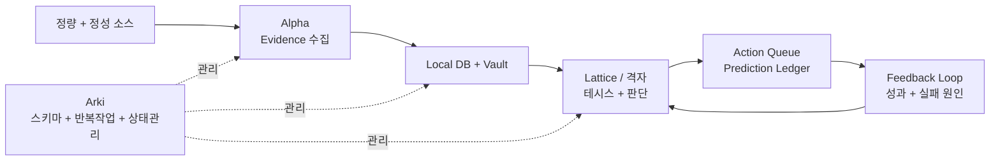

# Thesis OS

[English README](README.md)

Thesis OS는 **테시스 기반 투자 리서치 OS**입니다.

정량 데이터와 정성 인텔리전스를 수집하고, 로컬 데이터베이스와 마크다운 vault에 축적한 뒤, 이를 투자 테시스, 행동 판단, 예측 원장, 사후 피드백 루프로 변환합니다.

목표는 자동매매 봇을 만드는 것이 아닙니다. 목표는 투자 판단을 더 명시적이고, 근거 기반이며, 감사 가능하고, 시간이 지날수록 개선 가능한 형태로 만드는 것입니다.

<p align="center">
  
</p>

## 핵심 루프



핵심은 명시성입니다. evidence를 모으고, 기억에 쓰고, 테시스를 만들고, 예측을 사전에 기록하고, 결과를 평가한 뒤, 다음 판단을 개선합니다.

## 왜 Thesis OS인가?

제가 느끼는 핵심 가치는 단순히 데이터를 모으거나 노트를 저장하는 데 있지 않습니다.

중요한 것은 **테시스 카드가 계속 살아 있어야 한다는 점**입니다.

- Alpha는 정량/정성 evidence를 계속 수집합니다.
- 한국과 미국 장 마감 이후 Alpha는 상장주식 local DB를 최신화합니다.
- 종목 발굴은 정량 스크리너, 소셜/커뮤니티 수집, 애널리스트 리포트 수집 세 채널로 매일 수행합니다.
- 종합 스크리닝은 종목별 신호를 Top 5 편입심사 큐로 압축합니다.
- 장중에는 보유종목과 관찰종목의 가격/수급 변화를 모니터링해 알람 후보를 만듭니다.
- Lattice/격자는 Alpha, 스크리너, 알람, local DB 데이터를 읽고 테시스 카드를 갱신합니다.
- 격자는 포트폴리오 편입, 증액, 홀드, 감액, 청산, 관찰 판단을 내립니다.
- 이후 3일, 1주, 1개월 같은 기간 단위로 판단 성과를 평가합니다.
- 그 결과가 다시 테시스, 스크리너 룰, 격자의 판단 프로세스에 환류됩니다.
- Arki는 vault, SSOT, wiki index, schema, 반복작업을 정리해 에이전트 참조가 최신 상태로 유지되게 합니다.

즉 Thesis OS의 본질은 **상장주식 DB 최신화 -> evidence 갱신 -> 3채널 종목 발굴 -> Top 5 압축 -> 격자 편입심사 -> 예측/행동 기록 -> 기간별 성과평가 -> 테시스와 판단 프로세스 업데이트**로 이어지는 완결적인 피드백 루프입니다.

## 운영 워크플로우

기본 워크플로우는 보유 종목과 워치리스트를 전제로 합니다.

1. 한국과 미국 장 마감 이후 Alpha가 상장주식 local DB를 최신화합니다.
2. Alpha가 티어1 정보, 뉴스, 공시, 시장 데이터, 정량 스크리너, 소셜/커뮤니티, 애널리스트 리포트 신호를 갱신합니다.
3. Alpha가 evidence record, market snapshot, intraday alert, screener candidate를 local DB와 vault에 저장합니다.
4. Alpha가 종합 스크리닝으로 매일 Top 5 편입심사 큐를 만듭니다.
5. 장중에는 보유종목과 관찰종목에 대해 가격/수급 알람을 생성합니다.
6. Lattice/격자가 최신 evidence로 thesis card를 검토하고, 포트폴리오 편입 여부를 심사합니다.
7. 격자가 매일 roundtable을 열어 증액, 홀드, 감액, 청산, 관찰 판단을 내립니다.
8. 판단이 시장 결과로 검증 가능하면 Prediction Ledger 또는 Action Queue에 사전 기록합니다.
9. 이후 기간별 성과평가가 테시스, 스크리너 룰, 격자의 판단 프로세스에 다시 환류됩니다.

기본 투자철학은 명확합니다. **멍거의 격자적 사고로 발굴하고, 윌리엄 오닐과 마크 미네르비니로 투자 타이밍을 선별하고, 드라켄밀러처럼 비대칭 기회에 집중적으로 베팅한다**는 구조입니다.

## 기본 투자철학

실제 Thesis OS 배포 환경에서는 vault에 **투자철학 원장**을 둘 수 있습니다. 공개 버전에서는 같은 원칙을 [Investment Philosophy](docs/investment-philosophy.md)에 문서화합니다. 철학은 감각으로 남겨두는 것이 아니라, 판단과 연결되고, 사후 피드백으로 검증되어야 합니다.

기본 철학은 세 층입니다.

| 층 | 투자자 렌즈 | Thesis OS에서의 의미 |
|---|---|---|
| 발굴 | 찰리 멍거 | evidence, 인센티브, 베이스레이트, 시장 구조, 밸류에이션, 리스크, 반대 논리를 격자처럼 엮어 기회를 찾음 |
| 타이밍 | 윌리엄 오닐 + 마크 미네르비니 | 상대강도, 주도주, 가격/거래량 구조, 과열 여부, 손절/무효화 조건으로 진입 타이밍을 선별 |
| 베팅 | 스탠리 드라켄밀러 | 근거, 타이밍, 손익비, 유연성이 맞을 때만 집중하고, 사실이 바뀌면 빠르게 바꿈 |

실제 운영에서는 이렇게 번역됩니다.

- Alpha는 정량 스크리너, 소셜 수집, 애널리스트 리포트 수집으로 후보를 발굴합니다.
- Lattice/격자는 멍거식 격자 사고로 후보를 하나의 스토리가 아니라 여러 렌즈로 해석합니다.
- 격자는 오닐/미네르비니식 타이밍 규율로 약한 셋업, 과열된 셋업, 무효화된 셋업을 걸러냅니다.
- 격자는 드라켄밀러식 관점으로 소수의 비대칭 기회에 집중하되, 증거가 바뀌면 판단을 바꿉니다.
- 피드백 루프는 이 철학이 실제로 판단 품질을 높였는지 기간별 성과로 검증합니다.

## 세 에이전트

### Alpha: Evidence

Alpha는 데이터를 수집하고 검증합니다.

- 정량 데이터: 가격, 거래량, 수급, 실적, 공시, 컨센서스, 공매도, 수출입 데이터
- 정성 데이터: 뉴스, 공시, 유튜브, 텔레그램, 페이스북, 뉴스레터, 커뮤니티 신호
- 발굴 채널: 정량 스크리너, 소셜/커뮤니티 수집, 애널리스트 리포트 수집
- 출력: evidence record, local DB snapshot, market refresh note, intraday alert, screener candidate, Top 5 discovery queue, research packet

### Lattice / 격자: Judgment

Lattice는 evidence를 투자 판단으로 바꿉니다.

이 이름은 찰리 멍거의 **격자적 사고**, 즉 *latticework of mental models*에서 따왔습니다. 좋은 투자 판단은 하나의 렌즈만으로 만들어지지 않습니다. evidence, 인센티브, 베이스레이트, 시장 구조, 밸류에이션, 리스크, 반대 논리를 함께 엮어야 합니다. 한국어 버전에서는 이 역할을 **격자**라고 부릅니다.

담당 범위:

- Thesis Registry
- Decision Card
- Devil's Advocate Gate
- Action Queue
- Prediction Ledger
- Feedback Interpretation
- Screener Forward-Performance Review
- Judgment Feedback Review

### Arki: System

Arki는 Research OS의 구조와 운영을 관리합니다.

- 스키마
- vault layout
- 반복작업
- health check
- migration log
- agent skill governance

## 빠른 시작

Python 3.10+이 필요합니다.

<p align="center">
  
</p>

```bash
git clone https://github.com/youngseongshin/thesis-os.git
cd thesis-os
python3 -m venv .venv
. .venv/bin/activate
python -m pip install -e .
python -m thesis_os demo --out ./demo_run
```

생성되는 workspace 구조:

<p align="center">
  
</p>

에이전트별 명령:

```bash
python -m thesis_os arki init --workspace ./workspace
python -m thesis_os alpha sample-collect --workspace ./workspace
python -m thesis_os alpha run-screener --workspace ./workspace
python -m thesis_os alpha run-quant-screener --workspace ./workspace \
  --input-csv ./demo_run/sample_quant_features.csv \
  --top-n 5
python -m thesis_os alpha discover --workspace ./workspace --top-n 5
python -m thesis_os alpha refresh-market-db --workspace ./workspace \
  --input-csv ./demo_run/sample_market_snapshots.csv
python -m thesis_os alpha intraday-monitor --workspace ./workspace \
  --input-csv ./demo_run/sample_intraday_events.csv
python -m thesis_os alpha list-screeners --workspace ./workspace
python -m thesis_os alpha list-evidence --workspace ./workspace
python -m thesis_os lattice build-thesis --workspace ./workspace
python -m thesis_os lattice decision-card --workspace ./workspace
python -m thesis_os lattice predict --workspace ./workspace \
  --prediction "Evidence가 유지되면 이 basket은 benchmark를 outperform해야 한다." \
  --direction relative_outperform \
  --horizon 1m
python -m thesis_os lattice evaluate-screener --workspace ./workspace \
  --candidate-id SCR-AI-INFRA-001 \
  --horizon 1m \
  --absolute-return 0.04 \
  --benchmark-return 0.015
python -m thesis_os lattice evaluate-judgment --workspace ./workspace \
  --action-id ACTION-SAMPLE-001 \
  --horizon 1m \
  --absolute-return 0.04 \
  --benchmark-return 0.015
python -m thesis_os lattice roundtable --workspace ./workspace
python -m thesis_os arki build-wiki-index --workspace ./workspace
```

## 공개 / 비공개 경계

공개 repo에 포함되는 것:

- 철학과 아키텍처 문서
- JSON schema
- 샘플 adapter contract
- 샘플 local DB / vault 생성
- prediction ledger와 feedback evaluator
- thesis card, nightly screening, concentrated strategy, screener feedback, social collection 샘플 산출물

공개 repo에 포함하지 않는 것:

- 실제 계좌/포트폴리오 데이터
- API key
- OAuth token
- 쿠키
- 텔레그램 세션
- Gmail 원문
- 유료 데이터 raw
- 사적 vault

## 샘플 산출물 팩

공개 repo에는 실제 Research OS의 구조를 이해할 수 있는 공개 안전 샘플 산출물이 포함되어 있습니다.

- [테시스 카드](examples/sample_outputs/thesis-card-ai-infrastructure-basket.md)
- [나이트 Top 5 딥다이브](examples/sample_outputs/nightly-top5-deep-dive.md)
- [나이트 집중전략 리뷰](examples/sample_outputs/nightly-concentration-strategy.md)
- [스크리너 종목 발굴 결과](examples/sample_outputs/screener-discovery-results.md)
- [스크리너 성과 피드백](examples/sample_outputs/screener-performance-feedback.md)
- [소셜 수집 요약](examples/sample_outputs/social-collection-summary.md)

이 샘플들은 모두 합성 예시입니다. 실제 포트폴리오, 실제 보유 비중, 사적 채널 원문, 계좌 정보, 유료 데이터 raw를 포함하지 않습니다. 자세한 공개 경계는 [Sample Output Pack](docs/sample-output-pack.md)을 참고하세요.

## 프로젝트 상태

현재는 public core scaffold 단계입니다. 하지만 최소 루프는 실제로 동작합니다.

1. Evidence 생성
2. Local DB와 vault 저장
3. Thesis 생성
4. Decision Card 생성
5. Prediction Ledger 기록
6. Feedback Report 생성
7. Screener Candidate 생성과 forward 성과평가
8. Vault wiki index와 SSOT note 생성
9. 증액/홀드/감액/청산/관찰 판단을 위한 sample roundtable 실행
10. 한국/미국 market snapshot refresh
11. 보유/관찰 종목 intraday alert 생성
12. 격자 판단/action의 기간별 성과평가

유용하다면 star를 눌러주세요. 이 프로젝트는 투자 판단을 “그럴듯한 설명”에서 “검증 가능한 판단 시스템”으로 바꾸는 것을 목표로 합니다.
