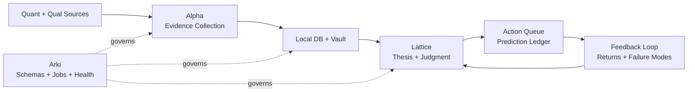

# Thesis OS

[](https://github.com/youngseongshin/thesis-investment-os/actions/workflows/ci.yml)
[](LICENSE)

[한국어 README](README.ko.md)

> Build investment research agents that do not just summarize markets. They maintain theses, make decisions, register predictions, and grade themselves later.

**Thesis OS is an evidence-first, thesis-driven investment research operating system.** It combines quantitative data, qualitative intelligence, local databases, vault memory, agent-ready workflows, prediction ledgers, and feedback loops into one auditable judgment loop.

It is built for investors and builders working on **stock research, stock screeners, equity research, portfolio management, trading journals, investment agents, and AI-assisted research workflows**.

It is not an autonomous trading bot, a signal seller, or an AI stock picker. It is a framework for making investment judgment explicit, testable, and improvable.

## What This Project Is

Thesis OS is not a clone of a private portfolio system and not a complete private deployment. It is a runnable open-source core for building your own thesis-driven investment research system.

Bring your own data sources, investing philosophy, watchlists, broker adapters, private notes, and agent prompts. Thesis OS gives you the operating structure: how to turn fragmented market information into theses, decisions, predictions, and feedback.

Most AI investing tools try to recommend stocks. Thesis OS takes a different route:

> Record why an investment idea should work, what would invalidate it, what action it implies, and whether it actually worked after time passed.

## What You Get

1. **A judgment object model**
   - Separate `thesis`, `evidence`, `action`, `prediction`, and `feedback`.
   - Turn vague investment conviction into records that can be reviewed later.

2. **A quant screener-to-judgment loop**
   - Connect quantitative stock screeners to candidate queues, thesis cards, and forward-return feedback.
   - Evaluate whether a screener signal worked over fixed horizons instead of just collecting interesting names.

3. **A multi-agent operating model**
   - Alpha collects and verifies evidence.
   - Lattice makes investment judgments and records predictions.
   - Arki governs schemas, vault structure, jobs, and system health.

4. **A local-first knowledge architecture**
   - Combine SQLite, markdown vault notes, SSOT rules, wiki indexes, and dashboards.
   - Reduce the common failure mode where research accumulates but becomes hard for humans and agents to retrieve.

5. **A runnable starter kit**
   - No-key public stock-data quickstart.
   - CSV-backed quantitative screener.
   - Sample thesis card, decision card, prediction ledger, feedback evaluator, vault notes, dashboard, and GitHub Actions CI.

## What You Can Try Today

No broker credentials, private chats, or paid feeds are required for the public quickstart.

| Goal | Start Here | Result |
|---|---|---|
| Run a no-key public stock loop | `thesis-os quickstart-stock --out ./quickstart_run --tickers NVDA,AAPL,MSFT --benchmark SPY` | Public price data -> quant screener -> thesis card -> prediction -> forward-return feedback -> dashboard |
| See the cockpit | `open ./quickstart_run/vault/dashboard/index.html` | A static review surface for theses, watchlists, actions, predictions, and feedback |
| Run the fully offline synthetic demo | `thesis-os demo --out ./demo_run` | Local DB, vault notes, sample thesis card, decision card, prediction ledger, feedback notes, and dashboard |
| Inspect realistic outputs | [`examples/sample_outputs/`](examples/sample_outputs/) | Public-safe thesis card, Top 5 deep dive, concentration strategy, screener results, screener feedback, and social collection |
| Extend the system | [`examples/sample_jobs.yaml`](examples/sample_jobs.yaml), [`examples/sample_agent_skills.yaml`](examples/sample_agent_skills.yaml) | Recurring job and skill contracts that keep automation auditable |

## Follow The Live Research

Thesis OS is the open-source framework. Korea Invest Insights is where the broader thesis-driven research workflow is published in public form.

| Channel | Link | What to expect |
|---|---|---|
| Blog | [Korea Invest Insights](https://koreainvestinsights.com/) | Longer stock research, Korean market analysis, semiconductor/AI infrastructure notes, and thesis-style writeups |
| Telegram | [@korea_invest_insights](https://t.me/korea_invest_insights) | Faster market notes, post alerts, and compact research updates |
| Substack | [Korea Invest Insights on Substack](https://koreainvestinsights.substack.com/) | Email-friendly essays and cross-posted investment research |

These channels are examples of a live research publishing surface. They are not required to run Thesis OS, and the repository does not include private portfolio data or private automation.

## Why It Is Different

| Common investment workflow | Thesis OS |
|---|---|
| Research notes pile up and go stale | Thesis cards stay linked to current evidence |
| Screeners produce lists with no accountability | Candidates are evaluated over forward horizons |
| LLMs write plausible narratives | Lattice records actions, predictions, invalidation, and feedback |
| Data lives in scattered tools | Local DB + markdown vault + wiki/SSOT keep retrieval clean |
| Automation is a bundle of scripts | Harness contracts define owner, trigger, inputs, outputs, delivery, and failure policy |
| Portfolio review is hard to audit | Dashboard cockpit shows theses, watchlist alerts, actions, predictions, and performance feedback |

## Bring Your Own Data

Thesis OS does not need to own the data layer. There are already many excellent public quantitative databases, official filings, and analysis libraries. The framework is designed to ingest them through adapters and keep the judgment trail auditable.

| Data layer | Examples | Use in Thesis OS |
|---|---|---|
| Price and volume | Yahoo Finance chart endpoint, Stooq, Yahoo Finance-compatible CSV exports, FinanceDataReader, OpenBB | market snapshots, screeners, forward-return feedback |
| Fundamentals and filings | SEC EDGAR, edgartools, DART/OpenDART, company IR pages | evidence records, thesis assumptions, invalidation checks |
| Korea listed equities | pykrx, KRX-derived files, FinanceDataReader, OpenDART | KR screeners, flows, short-sale/stock-loan overlays where available |
| Macro and supply-chain proxy | FRED, central banks, statistical agencies, customs/export-import APIs | regime evidence, sector proxy evidence, risk checks |
| Alternative public datasets | Nasdaq Data Link free datasets, Hugging Face datasets, Kaggle datasets with compatible licenses | thematic research, classifiers, event datasets |

The default quickstart uses a no-key public Yahoo Finance chart endpoint to prove the loop. Serious users can replace that adapter with OpenBB, FinanceDataReader, pykrx, EDGAR/DART, broker exports, licensed datasets, or their own research database. Always check license, delay, redistribution, corporate-action adjustment, and survivorship-bias rules before production use. See [Public Data Sources](docs/public-data-sources.md).

## Run It In 60 Seconds

```bash
git clone https://github.com/youngseongshin/thesis-investment-os.git
cd thesis-investment-os
python3 -m venv .venv
. .venv/bin/activate
python -m pip install -e .
thesis-os quickstart-stock --out ./quickstart_run --tickers NVDA,AAPL,MSFT --benchmark SPY
```

The quickstart uses public no-key daily stock data by default. It creates a local SQLite DB, markdown vault, quantitative screener candidates, thesis card, decision card, prediction ledger, forward-return feedback notes, wiki/SSOT notes, and a static dashboard at `quickstart_run/vault/dashboard/index.html`.

Prefer a fully offline run? Use `thesis-os demo --out ./demo_run` to generate synthetic public-safe sample data.

<p align="center">
  
</p>

<p align="center">
  
</p>

## Core Idea

Investment work is often scattered across charts, filings, chats, notes, videos, news, spreadsheets, and memory. Thesis OS turns those fragments into a structured loop:



The loop is deliberately explicit: collect evidence, write memory, form a thesis, register a prediction, evaluate the outcome, and improve the next judgment.

## Why Thesis OS?

Most investment workflows have the same failure mode: the research may be good, but the judgment trail is hard to audit later.

Thesis OS focuses on the part that compounds:

- Alpha refreshes KR/US listed-equity local databases after the relevant market close.
- Alpha continuously collects quantitative and qualitative evidence.
- Daily discovery starts from quantitative screeners, then uses social/community collection and analyst-report collection as context overlays.
- Integrated screening compresses the daily universe to a Top 5 portfolio-review queue.
- Lattice reviews whether each candidate belongs in the portfolio or only on the watchlist.
- Intraday monitors route price and flow alerts for holdings and watchlist names.
- Lattice keeps thesis cards current by reading Alpha evidence, screeners, alerts, and local DB snapshots.
- Lattice records predictions before outcomes are known.
- Feedback jobs evaluate whether Lattice's entity-level and portfolio-inclusion judgments worked over fixed horizons.
- Arki keeps the vault, SSOT notes, schemas, and wiki index clean enough for agents to retrieve current context.

The value is the closed loop: **market DB refresh -> evidence refresh -> three-channel discovery -> Top 5 screening -> Lattice portfolio review -> prediction/action -> forward performance review -> thesis/process update**.

## Operating Workflow

The default workflow is built for holdings and watchlists:

1. After Korea and US market close, Alpha refreshes local listed-equity databases.
2. Alpha refreshes Tier 1 information, news, filings, social/community signals, analyst-report signals, and screener signals.
3. Alpha writes evidence records, market snapshots, alerts, and screener candidates into the local DB and vault.
4. Alpha compresses daily discovery into a Top 5 portfolio-review queue.
5. During the trading day, Alpha monitors holdings and watchlist names for price and flow alerts.
6. Lattice reviews thesis cards with current evidence and decides whether candidates deserve portfolio inclusion.
7. Lattice runs a daily roundtable for increase, hold, decrease, exit, or watch decisions.
8. Lattice registers predictions or actions when a judgment has a measurable market implication.
9. Feedback jobs evaluate outcomes over fixed horizons and feed lessons back into thesis cards, screener rules, and Lattice judgment process.

The default philosophy is deliberately explicit: use Munger's latticework to discover and understand opportunities, use William O'Neil and Mark Minervini to filter timing and risk, and bet with a Druckenmiller-style focus on concentration, flexibility, and asymmetry.

## Default Investment Philosophy

A live Thesis OS deployment can maintain an **Investment Philosophy Ledger** in its vault. The public version documents the same idea in [Investment Philosophy](docs/investment-philosophy.md): philosophy should be written down, linked to decisions, and audited through feedback rather than left as vague taste.

The default operating philosophy has three layers:

| Layer | Investor Lens | Thesis OS Translation |
|---|---|---|
| Discovery | Charlie Munger | Use a latticework of mental models to find ideas from evidence, incentives, base rates, market structure, valuation, and counterarguments |
| Timing | William O'Neil + Mark Minervini | Require leadership, relative strength, constructive price/volume action, controlled extension risk, and clear invalidation |
| Betting | Stanley Druckenmiller | Concentrate only when evidence, timing, risk/reward, and flexibility align; change quickly when facts change |

In practice:

- Alpha finds candidates through quantitative screeners first; social collection and analyst-report collection enrich context rather than becoming screener points by themselves.
- Lattice interprets candidates through the Munger-style lattice rather than a single narrative.
- Lattice uses O'Neil/Minervini-style timing discipline to avoid buying weak, extended, or invalidated setups.
- Lattice sizes and prioritizes through a Druckenmiller-style lens: few high-conviction opportunities, asymmetric upside, and willingness to reverse when evidence changes.
- Feedback jobs test whether this philosophy actually improved decisions.

## Three Agents

### Alpha: Evidence

Alpha collects, normalizes, and verifies quantitative and qualitative inputs.

- Quant data: prices, volume, flows, fundamentals, filings, consensus, short interest, exports/imports
- Qualitative data: news, filings, transcripts, Telegram, Facebook, YouTube, newsletters, community signals
- Discovery channels: quantitative screeners first, plus social/community and analyst-report context overlays
- Output: evidence records, local DB snapshots, market refresh notes, intraday alerts, screener candidates, Top 5 discovery queues, research packets

### Lattice: Judgment

Lattice turns evidence into investment judgment.

The name comes from Charlie Munger's idea of a "latticework of mental models." The agent is not meant to rely on one lens. It should combine evidence, incentives, base rates, market structure, valuation, risk, and counterarguments into a more disciplined investment judgment. In Korean materials, this role can be called **격자**.

- Thesis registry
- Decision cards
- Devil's advocate gate
- Action queue
- Prediction ledger
- Feedback interpretation
- Screener forward-performance review
- Judgment feedback review for entity-level and portfolio-inclusion decisions

### Arki: System

Arki maintains the operating system.

- Schemas
- Vault layout
- Recurring jobs
- Health checks
- Migration logs
- Agent skill governance

## What This Repository Provides

This repository is the open-source core. It intentionally excludes broker credentials, private portfolio data, real Telegram channel IDs, Gmail contents, cookies, OAuth sessions, and paid raw data.

The included features are organized around the judgment loop, not around isolated tools:

| System layer | What is included | Why it matters |
|---|---|---|
| **Philosophy and object model** | Philosophy docs, architecture docs, agent persona contracts, prompt-boundary guidance, and JSON schemas for `thesis`, `evidence`, `action`, `prediction`, `feedback`, skills, and jobs | Makes investment judgment explicit instead of leaving it as notes, taste, or chat history |
| **Evidence layer** | Public adapter interfaces, sample local SQLite DB generation, sample vault note generation, KR/US market DB refresh adapter, intraday holdings/watchlist alert adapter, and CSV-backed trade/customs proxy evidence adapter | Gives Alpha a clean way to turn market data, filings, flows, screeners, and specialized data into auditable evidence |
| **Quant discovery and screening** | CSV-backed Alpha-style quantitative screener, screener candidate schema, three-channel discovery pattern, Top 5 compression, and screener feedback loop | Turns stock screeners into accountable candidate generators rather than one-off lists |
| **Judgment layer** | Thesis card generation, decision cards, devil's advocate pattern, action queue, prediction ledger, Lattice roundtable, concentrated strategy sample, and judgment feedback loop | Turns evidence into reviewable portfolio/watchlist decisions with invalidation and measurable outcomes |
| **Memory and vault governance** | Memory management process, markdown vault generation, document policy pattern, codeowner/canonical-path governance, vault wiki index, and SSOT note generation | Keeps research retrievable and current for both humans and agents |
| **Automation harness** | Recurring job manifest, harness contract schema, ownership/input/output/delivery/failure-policy validator, health checks, and GitHub Actions CI | Makes the system operable as a repeatable workflow rather than a pile of scripts |
| **Human review surface** | Static HTML dashboard cockpit and public-safe sample output pack for thesis cards, nightly screening, concentrated strategy, screener feedback, and social collection | Lets users inspect the loop visually before attaching private data or real adapters |

Excluded:

- Real account data
- Real brokerage/session adapters
- Private vault contents
- API keys and secrets
- User-specific chat history

## Sample Output Pack

The repository includes sanitized examples of the outputs a Thesis OS deployment can produce:

| Output | What It Demonstrates |
|---|---|
| [Thesis card](examples/sample_outputs/thesis-card-ai-infrastructure-basket.md) | How evidence, assumptions, invalidation, and action hooks live in one card |
| [Nightly Top 5 deep dive](examples/sample_outputs/nightly-top5-deep-dive.md) | How daily discovery compresses candidates before portfolio review |
| [Nightly concentrated strategy](examples/sample_outputs/nightly-concentration-strategy.md) | How Lattice turns candidates into concentration, hold, trim, or watch judgments |
| [Screener discovery results](examples/sample_outputs/screener-discovery-results.md) | How quantitative screeners create explainable candidate queues |
| [Screener performance feedback](examples/sample_outputs/screener-performance-feedback.md) | How forward returns grade whether a screener signal actually worked |
| [Social collection summary](examples/sample_outputs/social-collection-summary.md) | How qualitative channels can be summarized without storing private raw feeds |

These examples are synthetic and public-safe. They demonstrate structure, not investment advice or real portfolio data. See [Sample Output Pack](docs/sample-output-pack.md) for the boundary rules.

## Agent Personas And Prompts

Agent design is part of the system. Thesis OS treats Alpha, Lattice, and Arki as different operating roles, not interchangeable chatbots.

- [Three-Agent Model](docs/three-agent-model.md)
- [Agent Persona Contracts](docs/agent-persona-contracts.md)

The public project documents reusable role contracts and output boundaries. A private deployment can extend those contracts into full system prompts while keeping user preferences, private memory, credentials, and operational details outside the public repository.

## Recurring Jobs

Thesis OS depends on durable recurring work. The public core includes:

- [Recurring Jobs](docs/recurring-jobs.md)
- [sample_jobs.yaml](examples/sample_jobs.yaml)

The manifest covers market-close DB refresh, Tier 1 evidence refresh, qualitative collection, screeners, Top 5 discovery, intraday monitoring, roundtables, concentrated strategy review, prediction evaluation, screener feedback, vault/wiki compilation, and health checks.

## Memory Management

Thesis OS treats memory as a managed process, not a dumping ground.

- [Memory Management](docs/memory-management.md)
- [Vault Governance](docs/vault-governance.md)
- [Vault, SSOT, And LLM Wiki](docs/vault-ssot-wiki.md)
- [sample_memory_policy.yaml](examples/sample_memory_policy.yaml)
- [sample_vault_policy.yaml](examples/sample_vault_policy.yaml)

The memory loop is:

```text
capture -> normalize -> classify -> promote/discard -> link -> summarize -> retrieve -> evaluate -> improve
```

Alpha owns evidence memory, Lattice owns judgment memory, and Arki owns system memory. The LLM wiki is a compact retrieval layer over canonical objects, not a raw archive.

Vault governance adds the write-side discipline:

```text
doc_type -> policy resolver -> canonical path -> codeowner check -> frontmatter -> write -> wiki index
```

## Dashboard Cockpit

Thesis OS can generate a static dashboard for human review:

- [Dashboard Cockpit](docs/dashboard-cockpit.md)

The cockpit summarizes thesis cards, holdings/watchlist alerts, market snapshots, screener candidates, action queue items, predictions, and performance feedback. It is generated from the local DB and vault, so it can be published as a periodic snapshot behind private authentication without exposing credentials or live broker sessions.

## Skills

Thesis OS is composed of reusable skills with explicit owners and boundaries.

- [Skills And Pipelines](docs/skills-and-pipelines.md)
- [Domain Specialist Skills](docs/domain-specialist-skills.md)
- [sample_agent_skills.yaml](examples/sample_agent_skills.yaml)
- [sample_skill_catalog.yaml](examples/sample_skill_catalog.yaml)

The public skill catalog includes social collection, Facebook collection, YouTube scout, real-time market monitoring, quantitative screening, Top 5 deep dives, semiconductor specialist analysis, Deep Alpha, devil's advocate, roundtable judgment, and feedback evaluation.

## Command Reference

Requires Python 3.10+.

<p align="center">
  
</p>

```bash
git clone https://github.com/youngseongshin/thesis-investment-os.git
cd thesis-investment-os
python3 -m venv .venv
. .venv/bin/activate
python -m pip install -e .
thesis-os quickstart-stock --out ./quickstart_run --tickers NVDA,AAPL,MSFT --benchmark SPY
```

The no-key public quickstart creates:

<p align="center">
  
</p>

- `quickstart_run/local/thesis_os.db`
- `quickstart_run/quickstart_market_snapshots.csv`
- `quickstart_run/quickstart_quant_features.csv`
- `quickstart_run/vault/evidence/`
- `quickstart_run/vault/screeners/`
- `quickstart_run/vault/theses/`
- `quickstart_run/vault/decisions/`
- `quickstart_run/vault/feedback/`
- `quickstart_run/vault/dashboard/index.html`
- `quickstart_run/prediction_ledger.jsonl`

You can also run without installing:

```bash
python -m thesis_os quickstart-stock --out ./quickstart_run --tickers NVDA,AAPL,MSFT --benchmark SPY
python -m thesis_os demo --out ./demo_run
python -m thesis_os lint --root .
```

Agent-specific commands:

```bash
python -m thesis_os arki init --workspace ./workspace
python -m thesis_os quickstart-stock --out ./quickstart_run \
  --tickers NVDA,AAPL,MSFT --benchmark SPY
python -m thesis_os alpha sample-collect --workspace ./workspace
python -m thesis_os alpha run-screener --workspace ./workspace
python -m thesis_os alpha run-quant-screener --workspace ./workspace \
  --input-csv ./demo_run/sample_quant_features.csv \
  --top-n 5
python -m thesis_os alpha discover --workspace ./workspace --top-n 5
python -m thesis_os alpha refresh-market-db --workspace ./workspace \
  --input-csv ./demo_run/sample_market_snapshots.csv
python -m thesis_os alpha intraday-monitor --workspace ./workspace \
  --input-csv ./demo_run/sample_intraday_events.csv
python -m thesis_os alpha trade-proxy --workspace ./workspace \
  --input-csv ./demo_run/sample_trade_proxy.csv \
  --proxy-name semiconductor-memory
python -m thesis_os alpha list-screeners --workspace ./workspace
python -m thesis_os alpha list-evidence --workspace ./workspace
python -m thesis_os lattice build-thesis --workspace ./workspace
python -m thesis_os lattice decision-card --workspace ./workspace
python -m thesis_os lattice predict --workspace ./workspace \
  --prediction "The basket should outperform if evidence remains positive." \
  --direction relative_outperform \
  --horizon 1m
python -m thesis_os lattice evaluate --workspace ./workspace \
  --prediction-id PRED_ID \
  --absolute-return 0.04 \
  --benchmark-return 0.015
python -m thesis_os lattice evaluate-screener --workspace ./workspace \
  --candidate-id SCR-AI-INFRA-001 \
  --horizon 1m \
  --absolute-return 0.04 \
  --benchmark-return 0.015
python -m thesis_os lattice evaluate-judgment --workspace ./workspace \
  --action-id ACTION-SAMPLE-001 \
  --horizon 1m \
  --absolute-return 0.04 \
  --benchmark-return 0.015
python -m thesis_os lattice roundtable --workspace ./workspace
python -m thesis_os arki build-wiki-index --workspace ./workspace
python -m thesis_os arki validate-harness --workspace ./workspace \
  --input-json ./demo_run/sample_harness_contracts.json
python -m thesis_os arki build-dashboard --workspace ./workspace
```

## Public / Private Boundary

Thesis OS is designed around a strict boundary:

```text
Public core:
  schemas, templates, vault writer, sample DB, job manifests, feedback evaluator

Private adapters:
  broker APIs, Telegram credentials, Gmail OAuth, paid feeds, real portfolio data
```

Use private repositories or local runtime secrets for anything that can identify a person, account, channel, portfolio, or private company.

## Project Status

This is an early public scaffold. The current implementation focuses on the minimum viable loop:

1. Collect evidence into a local DB and markdown vault.
2. Run screeners and daily discovery to create review candidates.
3. Build a thesis card and decision card from current evidence.
4. Register a prediction before the outcome is known.
5. Evaluate screener candidates, predictions, and Lattice actions over fixed horizons.
6. Compile wiki/SSOT notes so agents can retrieve the current canonical context.
7. Export a dashboard cockpit for theses, watchlists, action queues, prediction ledgers, and feedback.
8. Validate recurring job contracts so automation remains auditable.

Specialized adapters such as trade/customs proxy data are included as examples of how to extend the evidence layer. They are not the center of the framework. The current coverage map is in [Thesis OS Coverage](docs/thesis-os-coverage.md).

The next milestones are connector interfaces, richer feedback metrics, reproducible job scheduling, and stronger dashboard examples.

## Launch Note

For the public positioning draft, see [Why Thesis OS Is Not Another Stock Picker](docs/public-launch-post.md). The short version: Thesis OS is not promising alpha. It is a starter framework for building an auditable stock research and trading-journal loop from public or private data sources.

## Community

If you believe investment agents should be auditable, evidence-linked, and self-improving instead of just persuasive, please star the repo. It helps more builders find the project.

Open issues with concrete agent ownership:

- Alpha for evidence collection
- Lattice for judgment
- Arki for system governance
