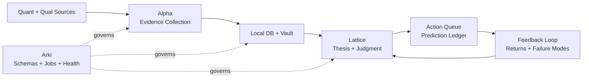

# Thesis OS

[](https://github.com/youngseongshin/thesis-os/actions/workflows/ci.yml)
[](LICENSE)

[한국어 README](README.ko.md)

Thesis OS is a three-agent, thesis-driven investment research operating system.

It combines quantitative market data, qualitative intelligence channels, local databases, long-term vault memory, agent skills, recurring research jobs, thesis registries, prediction ledgers, and feedback loops.

The goal is not to build an autonomous trading bot. The goal is to make investment judgment explicit, evidence-backed, auditable, and improvable over time.

## Core Idea

Investment work is often scattered across charts, filings, chats, notes, videos, news, spreadsheets, and memory. Thesis OS turns those fragments into a structured loop:



The loop is deliberately explicit: collect evidence, write memory, form a thesis, register a prediction, evaluate the outcome, and improve the next judgment.

## Three Agents

### Alpha: Evidence

Alpha collects, normalizes, and verifies quantitative and qualitative inputs.

- Quant data: prices, volume, flows, fundamentals, filings, consensus, short interest, exports/imports
- Qualitative data: news, filings, transcripts, Telegram, Facebook, YouTube, newsletters, community signals
- Output: evidence records, local DB snapshots, screener candidates, research packets

### Lattice: Judgment

Lattice turns evidence into investment judgment.

The name comes from Charlie Munger's idea of a "latticework of mental models." The agent is not meant to rely on one lens. It should combine evidence, incentives, base rates, market structure, valuation, risk, and counterarguments into a more disciplined investment judgment. In Korean materials, this role can be called **격자**.

- Thesis registry
- Decision cards
- Devil's advocate gate
- Action queue
- Prediction ledger
- Feedback interpretation

### Arki: System

Arki maintains the operating system.

- Schemas
- Vault layout
- Recurring jobs
- Health checks
- Migration logs
- Agent skill governance

## What This Repository Provides

This repository is the open-source core. It intentionally excludes broker credentials, private portfolio data, real Telegram channel IDs, Gmail contents, cookies, OAuth sessions, and paid raw data.

Included:

- Philosophy and architecture docs
- JSON schemas for thesis, evidence, prediction, action, feedback, skills, and recurring jobs
- A minimal runnable Python package
- Sample local SQLite database generation
- Sample vault note generation
- Sample prediction ledger and feedback report
- Public adapter interfaces and examples

Excluded:

- Real account data
- Real brokerage/session adapters
- Private vault contents
- API keys and secrets
- User-specific chat history

## Quickstart

Requires Python 3.10+.

```bash
git clone https://github.com/youngseongshin/thesis-os.git
cd thesis-os
python3 -m venv .venv
. .venv/bin/activate
python -m pip install -e .
thesis-os demo --out ./demo_run
```

The demo creates:

- `demo_run/local/thesis_os.db`
- `demo_run/vault/evidence/`
- `demo_run/vault/theses/`
- `demo_run/vault/decisions/`
- `demo_run/vault/feedback/`
- `demo_run/prediction_ledger.jsonl`

You can also run without installing:

```bash
python -m thesis_os demo --out ./demo_run
python -m thesis_os lint --root .
```

Agent-specific commands:

```bash
python -m thesis_os arki init --workspace ./workspace
python -m thesis_os alpha sample-collect --workspace ./workspace
python -m thesis_os alpha list-evidence --workspace ./workspace
python -m thesis_os lattice build-thesis --workspace ./workspace
python -m thesis_os lattice decision-card --workspace ./workspace
python -m thesis_os lattice predict --workspace ./workspace \
  --prediction "The basket should outperform if evidence remains positive." \
  --direction relative_outperform \
  --horizon 1m
python -m thesis_os lattice evaluate --workspace ./workspace \
  --prediction-id PRED_ID \
  --absolute-return 0.04 \
  --benchmark-return 0.015
```

## Public / Private Boundary

Thesis OS is designed around a strict boundary:

```text
Public core:
  schemas, templates, vault writer, sample DB, job manifests, feedback evaluator

Private adapters:
  broker APIs, Telegram credentials, Gmail OAuth, paid feeds, real portfolio data
```

Use private repositories or local runtime secrets for anything that can identify a person, account, channel, portfolio, or private company.

## Project Status

This is an early public scaffold. The current implementation focuses on the minimum viable loop:

1. Create evidence
2. Store evidence in a local DB and vault
3. Create a thesis
4. Create a decision card
5. Register a prediction
6. Generate a feedback report

The next milestones are connector interfaces, richer feedback metrics, and reproducible job scheduling.

## Community

If this project is useful, please star it and open issues with concrete agent ownership:

- Alpha for evidence collection
- Lattice for judgment
- Arki for system governance
