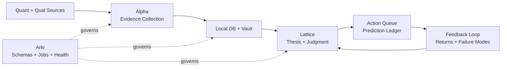

# Thesis OS

[](https://github.com/youngseongshin/thesis-os/actions/workflows/ci.yml)
[](LICENSE)

[한국어 README](README.ko.md)

Thesis OS is a three-agent, thesis-driven investment research operating system.

It combines quantitative market data, qualitative intelligence channels, local databases, long-term vault memory, agent skills, recurring research jobs, thesis registries, prediction ledgers, and feedback loops.

The goal is not to build an autonomous trading bot. The goal is to make investment judgment explicit, evidence-backed, auditable, and improvable over time.

<p align="center">
  
</p>

## Core Idea

Investment work is often scattered across charts, filings, chats, notes, videos, news, spreadsheets, and memory. Thesis OS turns those fragments into a structured loop:



The loop is deliberately explicit: collect evidence, write memory, form a thesis, register a prediction, evaluate the outcome, and improve the next judgment.

## Why Thesis OS?

Most investment workflows have the same failure mode: the research may be good, but the judgment trail is hard to audit later.

Thesis OS focuses on the part that compounds:

- Alpha refreshes KR/US listed-equity local databases after the relevant market close.
- Alpha continuously collects quantitative and qualitative evidence.
- Daily discovery runs through three channels: quantitative screeners, social/community collection, and analyst-report collection.
- Integrated screening compresses the daily universe to a Top 5 portfolio-review queue.
- Lattice reviews whether each candidate belongs in the portfolio or only on the watchlist.
- Intraday monitors route price and flow alerts for holdings and watchlist names.
- Lattice keeps thesis cards current by reading Alpha evidence, screeners, alerts, and local DB snapshots.
- Lattice records predictions before outcomes are known.
- Feedback jobs evaluate whether Lattice's entity-level and portfolio-inclusion judgments worked over fixed horizons.
- Arki keeps the vault, SSOT notes, schemas, and wiki index clean enough for agents to retrieve current context.

The value is the closed loop: **market DB refresh -> evidence refresh -> three-channel discovery -> Top 5 screening -> Lattice portfolio review -> prediction/action -> forward performance review -> thesis/process update**.

## Operating Workflow

The default workflow is built for holdings and watchlists:

1. After Korea and US market close, Alpha refreshes local listed-equity databases.
2. Alpha refreshes Tier 1 information, news, filings, social/community signals, analyst-report signals, and screener signals.
3. Alpha writes evidence records, market snapshots, alerts, and screener candidates into the local DB and vault.
4. Alpha compresses daily discovery into a Top 5 portfolio-review queue.
5. During the trading day, Alpha monitors holdings and watchlist names for price and flow alerts.
6. Lattice reviews thesis cards with current evidence and decides whether candidates deserve portfolio inclusion.
7. Lattice runs a daily roundtable for increase, hold, decrease, exit, or watch decisions.
8. Lattice registers predictions or actions when a judgment has a measurable market implication.
9. Feedback jobs evaluate outcomes over fixed horizons and feed lessons back into thesis cards, screener rules, and Lattice judgment process.

The default philosophy is deliberately explicit: use Munger's latticework to discover and understand opportunities, use William O'Neil and Mark Minervini to filter timing and risk, and bet with a Druckenmiller-style focus on concentration, flexibility, and asymmetry.

## Default Investment Philosophy

A live Thesis OS deployment can maintain an **Investment Philosophy Ledger** in its vault. The public version documents the same idea in [Investment Philosophy](docs/investment-philosophy.md): philosophy should be written down, linked to decisions, and audited through feedback rather than left as vague taste.

The default operating philosophy has three layers:

| Layer | Investor Lens | Thesis OS Translation |
|---|---|---|
| Discovery | Charlie Munger | Use a latticework of mental models to find ideas from evidence, incentives, base rates, market structure, valuation, and counterarguments |
| Timing | William O'Neil + Mark Minervini | Require leadership, relative strength, constructive price/volume action, controlled extension risk, and clear invalidation |
| Betting | Stanley Druckenmiller | Concentrate only when evidence, timing, risk/reward, and flexibility align; change quickly when facts change |

In practice:

- Alpha finds candidates through quantitative screeners, social collection, and analyst-report collection.
- Lattice interprets candidates through the Munger-style lattice rather than a single narrative.
- Lattice uses O'Neil/Minervini-style timing discipline to avoid buying weak, extended, or invalidated setups.
- Lattice sizes and prioritizes through a Druckenmiller-style lens: few high-conviction opportunities, asymmetric upside, and willingness to reverse when evidence changes.
- Feedback jobs test whether this philosophy actually improved decisions.

## Three Agents

### Alpha: Evidence

Alpha collects, normalizes, and verifies quantitative and qualitative inputs.

- Quant data: prices, volume, flows, fundamentals, filings, consensus, short interest, exports/imports
- Qualitative data: news, filings, transcripts, Telegram, Facebook, YouTube, newsletters, community signals
- Discovery channels: quantitative screeners, social/community collection, analyst-report collection
- Output: evidence records, local DB snapshots, market refresh notes, intraday alerts, screener candidates, Top 5 discovery queues, research packets

### Lattice: Judgment

Lattice turns evidence into investment judgment.

The name comes from Charlie Munger's idea of a "latticework of mental models." The agent is not meant to rely on one lens. It should combine evidence, incentives, base rates, market structure, valuation, risk, and counterarguments into a more disciplined investment judgment. In Korean materials, this role can be called **격자**.

- Thesis registry
- Decision cards
- Devil's advocate gate
- Action queue
- Prediction ledger
- Feedback interpretation
- Screener forward-performance review
- Judgment feedback review for entity-level and portfolio-inclusion decisions

### Arki: System

Arki maintains the operating system.

- Schemas
- Vault layout
- Recurring jobs
- Health checks
- Migration logs
- Agent skill governance

## What This Repository Provides

This repository is the open-source core. It intentionally excludes broker credentials, private portfolio data, real Telegram channel IDs, Gmail contents, cookies, OAuth sessions, and paid raw data.

Included:

- Philosophy and architecture docs
- Agent persona contracts and prompt-boundary guidance
- Memory management process for vault, local DB, LLM wiki, predictions, and feedback
- Vault governance pattern for document policy, codeowners, canonical paths, validators, and cleanup
- Skill catalog for collection, real-time data, deep dive, semiconductor specialist, Deep Alpha, devil's advocate, and feedback workflows
- JSON schemas for thesis, evidence, prediction, action, feedback, skills, and recurring jobs
- A minimal runnable Python package
- Sample local SQLite database generation
- Sample vault note generation
- Sample prediction ledger and feedback report
- Public adapter interfaces and examples
- Screener candidate and screener feedback loop
- CSV-backed Alpha-style quantitative screener
- Three-channel daily discovery and Top 5 compression
- KR/US market DB refresh adapter
- Intraday holdings/watchlist alert adapter
- Lattice judgment feedback loop
- Vault wiki index and SSOT note generation
- Public-safe sample output pack for thesis cards, nightly screening, concentrated strategy, screener feedback, and social collection
- Public-safe recurring job manifest for market refresh, source collection, screeners, roundtable, feedback, wiki, and health checks

Excluded:

- Real account data
- Real brokerage/session adapters
- Private vault contents
- API keys and secrets
- User-specific chat history

## Sample Output Pack

The repository includes sanitized examples of the outputs a Thesis OS deployment can produce:

- [Thesis card](examples/sample_outputs/thesis-card-ai-infrastructure-basket.md)
- [Nightly Top 5 deep dive](examples/sample_outputs/nightly-top5-deep-dive.md)
- [Nightly concentrated strategy](examples/sample_outputs/nightly-concentration-strategy.md)
- [Screener discovery results](examples/sample_outputs/screener-discovery-results.md)
- [Screener performance feedback](examples/sample_outputs/screener-performance-feedback.md)
- [Social collection summary](examples/sample_outputs/social-collection-summary.md)

These examples are synthetic and public-safe. They demonstrate structure, not investment advice or real portfolio data. See [Sample Output Pack](docs/sample-output-pack.md) for the boundary rules.

## Agent Personas And Prompts

Agent design is part of the system. Thesis OS treats Alpha, Lattice, and Arki as different operating roles, not interchangeable chatbots.

- [Three-Agent Model](docs/three-agent-model.md)
- [Agent Persona Contracts](docs/agent-persona-contracts.md)

The public project documents reusable role contracts and output boundaries. A private deployment can extend those contracts into full system prompts while keeping user preferences, private memory, credentials, and operational details outside the public repository.

## Recurring Jobs

Thesis OS depends on durable recurring work. The public core includes:

- [Recurring Jobs](docs/recurring-jobs.md)
- [sample_jobs.yaml](examples/sample_jobs.yaml)

The manifest covers market-close DB refresh, Tier 1 evidence refresh, qualitative collection, screeners, Top 5 discovery, intraday monitoring, roundtables, concentrated strategy review, prediction evaluation, screener feedback, vault/wiki compilation, and health checks.

## Memory Management

Thesis OS treats memory as a managed process, not a dumping ground.

- [Memory Management](docs/memory-management.md)
- [Vault Governance](docs/vault-governance.md)
- [Vault, SSOT, And LLM Wiki](docs/vault-ssot-wiki.md)
- [sample_memory_policy.yaml](examples/sample_memory_policy.yaml)
- [sample_vault_policy.yaml](examples/sample_vault_policy.yaml)

The memory loop is:

```text
capture -> normalize -> classify -> promote/discard -> link -> summarize -> retrieve -> evaluate -> improve
```

Alpha owns evidence memory, Lattice owns judgment memory, and Arki owns system memory. The LLM wiki is a compact retrieval layer over canonical objects, not a raw archive.

Vault governance adds the write-side discipline:

```text
doc_type -> policy resolver -> canonical path -> codeowner check -> frontmatter -> write -> wiki index
```

## Skills

Thesis OS is composed of reusable skills with explicit owners and boundaries.

- [Skills And Pipelines](docs/skills-and-pipelines.md)
- [Domain Specialist Skills](docs/domain-specialist-skills.md)
- [sample_agent_skills.yaml](examples/sample_agent_skills.yaml)
- [sample_skill_catalog.yaml](examples/sample_skill_catalog.yaml)

The public skill catalog includes social collection, Facebook collection, YouTube scout, real-time market monitoring, quantitative screening, Top 5 deep dives, semiconductor specialist analysis, Deep Alpha, devil's advocate, roundtable judgment, and feedback evaluation.

## Quickstart

Requires Python 3.10+.

<p align="center">
  
</p>

```bash
git clone https://github.com/youngseongshin/thesis-os.git
cd thesis-os
python3 -m venv .venv
. .venv/bin/activate
python -m pip install -e .
thesis-os demo --out ./demo_run
```

The demo creates:

<p align="center">
  
</p>

- `demo_run/local/thesis_os.db`
- `demo_run/vault/evidence/`
- `demo_run/vault/theses/`
- `demo_run/vault/decisions/`
- `demo_run/vault/feedback/`
- `demo_run/prediction_ledger.jsonl`

You can also run without installing:

```bash
python -m thesis_os demo --out ./demo_run
python -m thesis_os lint --root .
```

Agent-specific commands:

```bash
python -m thesis_os arki init --workspace ./workspace
python -m thesis_os alpha sample-collect --workspace ./workspace
python -m thesis_os alpha run-screener --workspace ./workspace
python -m thesis_os alpha run-quant-screener --workspace ./workspace \
  --input-csv ./demo_run/sample_quant_features.csv \
  --top-n 5
python -m thesis_os alpha discover --workspace ./workspace --top-n 5
python -m thesis_os alpha refresh-market-db --workspace ./workspace \
  --input-csv ./demo_run/sample_market_snapshots.csv
python -m thesis_os alpha intraday-monitor --workspace ./workspace \
  --input-csv ./demo_run/sample_intraday_events.csv
python -m thesis_os alpha list-screeners --workspace ./workspace
python -m thesis_os alpha list-evidence --workspace ./workspace
python -m thesis_os lattice build-thesis --workspace ./workspace
python -m thesis_os lattice decision-card --workspace ./workspace
python -m thesis_os lattice predict --workspace ./workspace \
  --prediction "The basket should outperform if evidence remains positive." \
  --direction relative_outperform \
  --horizon 1m
python -m thesis_os lattice evaluate --workspace ./workspace \
  --prediction-id PRED_ID \
  --absolute-return 0.04 \
  --benchmark-return 0.015
python -m thesis_os lattice evaluate-screener --workspace ./workspace \
  --candidate-id SCR-AI-INFRA-001 \
  --horizon 1m \
  --absolute-return 0.04 \
  --benchmark-return 0.015
python -m thesis_os lattice evaluate-judgment --workspace ./workspace \
  --action-id ACTION-SAMPLE-001 \
  --horizon 1m \
  --absolute-return 0.04 \
  --benchmark-return 0.015
python -m thesis_os lattice roundtable --workspace ./workspace
python -m thesis_os arki build-wiki-index --workspace ./workspace
```

## Public / Private Boundary

Thesis OS is designed around a strict boundary:

```text
Public core:
  schemas, templates, vault writer, sample DB, job manifests, feedback evaluator

Private adapters:
  broker APIs, Telegram credentials, Gmail OAuth, paid feeds, real portfolio data
```

Use private repositories or local runtime secrets for anything that can identify a person, account, channel, portfolio, or private company.

## Project Status

This is an early public scaffold. The current implementation focuses on the minimum viable loop:

1. Create evidence
2. Store evidence in a local DB and vault
3. Create a thesis
4. Create a decision card
5. Register a prediction
6. Generate a feedback report
7. Generate screener candidates and evaluate their forward performance
8. Generate vault wiki and SSOT notes
9. Run a sample Lattice roundtable for increase/hold/decrease/exit/watch decisions
10. Refresh sample KR/US market snapshots
11. Generate sample intraday alerts
12. Evaluate a Lattice decision/action over a fixed horizon

The next milestones are connector interfaces, richer feedback metrics, and reproducible job scheduling.

## Community

If this project is useful, please star it and open issues with concrete agent ownership:

- Alpha for evidence collection
- Lattice for judgment
- Arki for system governance
